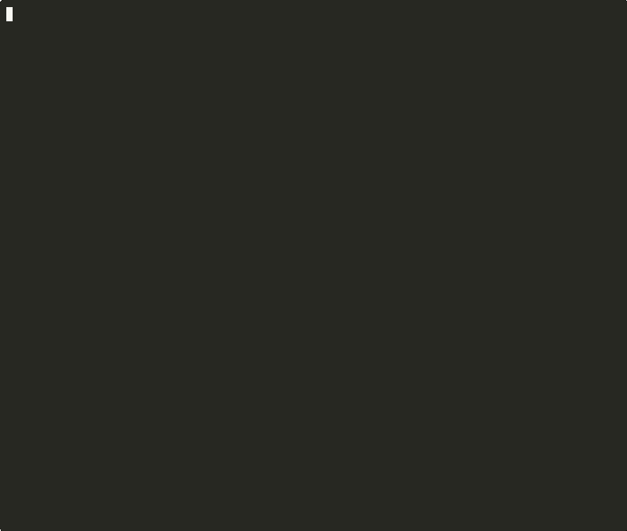

# sentinel-kernel

**Prove your AI decisions to the auditor. In Python. In five minutes.**

*One decorator. One command. One signed PDF evidence pack. Runs fully
offline. No US cloud dependency. Apache 2.0, forever.*

*Evidence infrastructure for the regulated AI era. Move like a startup.
Prove like a regulated bank.*

**EU AI Act enforcement starts 2 August 2026.**



```bash
pipx install 'sentinel-kernel[pdf]'
sentinel demo                  # 20 seconds, no config
```

**🔗 [Live preview & interactive demo](https://sebastianweiss83.github.io/sentinel-kernel/)**

**See the real artefact before you install:**
&nbsp;📄 [Sample evidence pack (PDF)](docs/samples/audit-evidence-pack-sample.pdf)
&nbsp;·&nbsp; 📋 [Sample `audit-gap` score](docs/samples/audit-gap-output.txt)
&nbsp;·&nbsp; 🎬 [20-second demo (GIF)](docs/samples/sentinel-demo.gif)

### Who are you?

- [**I'm a developer**](docs/personas/developer.md) — integrate in 12 lines, see the trace
- [**I'm a compliance officer / DPO**](docs/personas/compliance-officer.md) — Art. 12/13/14/17 evidence, honest gap report
- [**I'm a CISO / security lead**](docs/personas/security-ciso.md) — jurisdictional posture, SBOM, incident response
- [**I'm an auditor**](docs/personas/auditor.md) — verify the evidence pack independently
- [**Buying for my team**](docs/personas/executive-brief.md) — one-page commercial brief

---

## What Sentinel is. What it is not.

Sentinel is **evidence infrastructure for the regulated AI era** — the
decision trace, policy enforcement, and evidence layer for EU AI Act
Art. 12 (logging), Art. 13 (transparency), Art. 14 (human oversight),
and Art. 17 (quality-management traceability).

Sentinel does **not** replace Art. 9 risk management, Art. 10 data
governance, Art. 11 technical documentation, or Art. 15 accuracy and
robustness controls — those are organisational obligations above this
layer. Run `sentinel audit-gap` to see the exact split for your setup.

→ Full article mapping: [docs/eu-ai-act.md](docs/eu-ai-act.md)
&nbsp;·&nbsp; Strategic context: [docs/vision.md](docs/vision.md)
&nbsp;·&nbsp; Phases: [docs/roadmap.md](docs/roadmap.md)

<!-- SYNC_ALL_README_START -->
[](https://pypi.org/project/sentinel-kernel/)
[](CHANGELOG.md)
[](https://www.apache.org/licenses/LICENSE-2.0)
[](https://github.com/sebastianweiss83/sentinel-kernel/actions)
[](https://github.com/sebastianweiss83/sentinel-kernel/actions)
[](CHANGELOG.md)
[](docs/eu-ai-act.md)
<!-- SYNC_ALL_README_END -->

**Get started in 2 minutes:** [docs/getting-started.md](docs/getting-started.md)

## The 5-minute pilot

Four commands. Zero accounts. Zero API keys. Zero network.

```bash
pipx install 'sentinel-kernel[pdf]'   # or: pip install 'sentinel-kernel[pdf]'
sentinel quickstart                   # scaffolds hello_sentinel.py + ./.sentinel/
python hello_sentinel.py              # runs 10 decisions, writes traces to SQLite
sentinel evidence-pack                # writes audit.pdf from those traces
sentinel audit-gap                    # scores how audit-ready you actually are
```

The `[pdf]` extra pulls [reportlab](https://www.reportlab.com/) (BSD-3,
UK-based, pure Python) so `sentinel evidence-pack` can produce a
signed PDF your auditor can read. If you prefer to keep dependencies
to the absolute minimum, `pip install sentinel-kernel` still works —
every command except `evidence-pack` runs unchanged, and
`evidence-pack` itself tells you how to add the PDF extra.

`sentinel quickstart` generates a 12-line Python file wrapping a plain
function with `@sentinel.trace`. Running it produces ten immutable,
EU AI Act Art. 12-conformant decision records in
`./.sentinel/traces.db`. `sentinel evidence-pack` turns those records
into a signed PDF a compliance auditor can read. `sentinel audit-gap`
then tells you exactly what else is still missing — and whether you
can close it with the library, a deployment decision, or human
authorship.

### Why the plain-Python example is the golden path

The scaffolded example deliberately wraps a plain function, not an
LLM call. That means no OpenAI key, no LangChain, no Azure account,
no network. You see the value before you spend a single second on
credentials. When you are ready to wrap your real agent, the change
is one line. See [docs/integration-guide.md](docs/integration-guide.md)
for LangChain, CrewAI, AutoGen, and FastAPI integrations.

### What `sentinel audit-gap` shows you

A typical first run scores **60 %** (library gaps closable with one
command each, deployment choices, and one Annex-IV-authorship item).
After `sentinel fix kill-switch` and `sentinel fix retention`, you're
at **80 %**. The remaining 20 % is explicitly organisational — no
tool can close it for you, and Sentinel is honest about that.

See the full static output: [docs/samples/audit-gap-output.txt](docs/samples/audit-gap-output.txt)

`sentinel audit-gap` is re-runnable. Every `sentinel fix ...` you
apply moves the score. The split into library / deployment /
organisational tells you exactly which gaps you can close alone and
which ones need a human in a room.

### Install notes

```bash
# macOS (recommended — avoids PEP 668 "externally-managed-environment")
brew install pipx
pipx install sentinel-kernel

# Linux / Docker / CI
pip install sentinel-kernel

# Alternative (always works, even on systems where the bin dir is off-PATH)
python3 -m pip install sentinel-kernel
python3 -m sentinel quickstart
```

### Full-stack reference demo (Docker)

```bash
git clone https://github.com/sebastianweiss83/sentinel-kernel
cd sentinel-kernel/demo
docker compose up --build
```

Then open **http://localhost:3001** (Grafana, `admin` / `sentinel`).
The demo runs a realistic EU defence contractor scenario — policy
evaluation, kill switch, sovereignty scan — streaming live traces
to Grafana. See [demo/README.md](demo/README.md) for what to look at.

## Five minutes to your first decision record

```python
from sentinel import Sentinel

sentinel = Sentinel()  # local storage, zero config, no network

@sentinel.trace
async def approve_request(payload: dict) -> dict:
    # your existing agent logic — unchanged
    return await your_agent.run(payload)

result = await approve_request({"action": "approve", "amount": 50000})
```

That's it. Every call now produces a tamper-resistant decision record:

```json
{
  "trace_id": "01hx7k9m2n3p4q5r6s7t8u9v0w",
  "timestamp": "2026-04-01T14:23:41.234Z",
  "agent": "approve_request",
  "model": "mistral/large-2",
  "policy_result": "ALLOW",
  "inputs_hash": "sha256:a3f8c2d19e4b67f0c1a5d8e2b9c3f4a7",
  "inputs": {},
  "output_hash": "sha256:d12c93f0a1b7e6d58a2490f3c1d7b8e4",
  "output": {},
  "sovereign_scope": "EU",
  "data_residency": "local",
  "schema_version": "1.0.0"
}
```

Stored locally. No cloud account. No API key. No network call.

**Privacy by default (v3.2.0+):** the default `Sentinel()` records the
SHA-256 hash of every input and output — enough for Art. 12 proof of
logging and for re-verification against the original — but does **not**
store the raw payloads. Opt in explicitly with
`Sentinel(store_inputs=True, store_outputs=True)` when you control the
data and have a legal basis. See
[docs/provability.md#privacy-by-default](docs/provability.md#privacy-by-default-v320).

---

## How it works

Every time an autonomous system makes a decision, Sentinel answers
three questions:

1. **May it do this?** — A policy evaluator runs before execution. If
   the decision violates policy, Sentinel blocks it and records the
   triggering rule.

2. **Why did it want to?** — The decision is traced with input hash,
   policy result, model, agent, and sovereignty scope — tamper-resistant
   and append-only.

3. **Do we need to intervene?** — The Art. 14 kill switch halts every
   decision instantly. Overrides are recorded as linked trace entries;
   the original record is never mutated.

Those three questions are what the *Trace → Attest → Audit → Comply*
lifecycle answers operationally. Art. 12, Art. 13, and Art. 14 of the
EU AI Act are automated side-effects of this mechanism, not a separate
project. For the deeper framing — the Evidence Infrastructure thesis,
the three operative levels, and the four modules — see
[docs/vision.md](docs/vision.md).

---

## Trace. Attest. Audit. Comply.

Four verbs. A causal chain. Together, the complete lifecycle of an AI
decision in a regulated environment.

**Trace.** Every AI decision is captured with context, input hash,
timestamp, policy result, and output. Append-only, tamper-resistant,
privacy-by-default (SHA-256 hash instead of raw input unless explicitly
configured), stored under the operator's jurisdiction. The
`@sentinel.trace` decorator shipped in v1.0 delivers this in one line.

Policy-as-code — OPA/Rego or Python rules — gates every call before it
executes. Versioned, testable, CI/CD-deployable. EU AI Act Art. 14
kill-switch is a first-class primitive. Multi-party approval gates are
available via `HumanOverride`.

**Attest.** Every decision trace is cryptographically attested —
SHA-256 over the canonical payload, signed with the operator's key,
optionally RFC-3161 timestamped via EU-sovereign TSAs (DFN-CERT,
D-Trust). Post-quantum ML-DSA-65 (FIPS 204) is available for long-term
retention scenarios. Attestations are portable, JSON-serialisable, and
independently verifiable.

**Audit.** Every attestation is independently verifiable without vendor
dependency. Integrity checks and counterfactual replay are
deterministic and offline. The auditor reproduces verification from
the artefact alone — no call-home, no cloud, no lock-in.

**Comply.** Every relevant subset of attestations aggregates into a
signed PDF evidence pack — mapped to EU AI Act, DORA, NIS2, and BSI
IT-Grundschutz, in a format an auditor accepts. `sentinel
evidence-pack --output audit.pdf` is the one command.

---

## With policy evaluation

```python
from sentinel import Sentinel, DataResidency
from sentinel.policy import SimpleRuleEvaluator
from sentinel.storage import FilesystemStorage

def within_threshold(ctx: dict) -> tuple[bool, str | None]:
    if ctx.get("amount", 0) > ctx.get("agent_threshold", 0):
        return False, "amount_exceeds_threshold"
    return True, None

# works fully offline — classified environments, air-gapped networks
sentinel = Sentinel(
    storage=FilesystemStorage("/mnt/traces"),
    policy_evaluator=SimpleRuleEvaluator({
        "policies/procurement.py": within_threshold,
    }),
    sovereign_scope="EU",
    data_residency=DataResidency.EU_DE,
)

@sentinel.trace(policy="policies/procurement.py")
async def evaluate_procurement(ctx: dict) -> dict:
    return await agent.run(ctx)
```

For OPA/Rego policies:

```python
from sentinel import Sentinel
from sentinel.policy import LocalRegoEvaluator

sentinel = Sentinel(
    policy_evaluator=LocalRegoEvaluator(opa_binary="opa"),
    # OPA runs in-process — no network, no OPA server
)

@sentinel.trace(policy="policies/procurement.rego")
async def evaluate_procurement(ctx: dict) -> dict:
    return await agent.run(ctx)
```

---

## What Sentinel does. What it doesn't.

| | Sentinel | Cloud observability tools | Proprietary platforms |
|---|---|---|---|
| Decision records (EU-operated, tamper-resistant) | ✓ | — | Vendor-jurisdicted |
| In-process policy evaluation | ✓ | — | — |
| Air-gapped operation | ✓ | — | — |
| BSI IT-Grundschutz path | ✓ | — | — |
| EU AI Act Art. 12/13/14/17 evidence layer | ✓ | — | Partial |
| Zero hard dependencies | ✓ | — | — |
| Apache 2.0 permanently | ✓ | Varies | — |
| US CLOUD Act exposure | **None** | Varies | **Unconditional** |

Sentinel is not an observability tool. It is not a content filter. It does not replace your LLM, your ML model, or your rule engine — it does not care which technology makes the decision. It wraps any Python function and produces a legally-valid, portable, auditor-grade record of every decision it makes.

---

## Who needs this

Sentinel is built for organisations deploying autonomous decisions in
regulated contexts. The urgent users, in order of regulatory pressure:

- **Financial services** — credit, fraud, AML and transaction approval
  under DORA-aligned logging and EU AI Act Annex III.
- **Insurance** — underwriting, claims triage and pricing with
  explainable decision records per GDPR Art. 22.
- **Public sector** — benefit eligibility, permit approval and
  administrative AI where transparency is statutory.
- **KRITIS / critical infrastructure** — operational AI decisions
  inside essential services under NIS2 and sector-specific regulation.
- **Defence** — logistics, procurement and dual-use assessment with
  air-gapped and classified deployment paths.

If your AI makes decisions that touch rights, access to services,
safety, or meaningful financial outcomes, EU AI Act Annex III likely
applies from 2 August 2026. Sentinel is the audit-trail layer for
those decisions. The architecture stays technology-agnostic — the
sectors above are where the deadline bites first.

---

## Deployment

**Local / development**
```python
sentinel = Sentinel()  # SQLite, no config
```

**On-premise enterprise**
```python
from sentinel import Sentinel, DataResidency
from sentinel.storage import SQLiteStorage

sentinel = Sentinel(
    storage=SQLiteStorage("/var/lib/sentinel/traces.db"),
    sovereign_scope="EU",
    data_residency=DataResidency.EU_DE,
)
# For PostgreSQL: from sentinel.storage.postgres import PostgresStorage
```

**Air-gapped / classified**
```python
from sentinel import Sentinel, DataResidency
from sentinel.storage import FilesystemStorage

sentinel = Sentinel(
    storage=FilesystemStorage("/mnt/traces"),
    data_residency=DataResidency.AIR_GAPPED,
)
# zero network connectivity required
# traces written as NDJSON, one file per day
```

---

## Why EU jurisdiction matters

The US CLOUD Act is the reason EU jurisdiction is not a preference but a structural constraint. 18 U.S.C. § 2713 requires US-incorporated companies to produce data stored anywhere in the world on valid legal process. This applies to EU data centres operated by US companies. No contract eliminates it.

EU AI Act Article 12 mandates automatic, tamper-resistant logging for high-risk AI systems from **2 August 2026**. Decision logs that are simultaneously accessible to US authorities do not satisfy this requirement from EU jurisdiction.

Sentinel's critical path contains no US-owned components. Sovereignty is the consequence, not the headline. The three provability conditions (jurisdictional integrity, air-gap operability, certifiable evidence chain) produce EU sovereignty as an outcome — see [docs/provability.md](docs/provability.md).

---

## Roadmap

| Module | Status | What |
|---|---|---|
| **Trace** | ✓ shipped (v1.0 → v3.3) | `@sentinel.trace`, SQLite / PostgreSQL / Filesystem backends, SHA-256 hashing, hash-only privacy by default |
| **Policy** | ✓ shipped (v1.0 → v3.3) | Policy-as-code, OPA/Rego + Python rules, kill switch (EU AI Act Art. 14), preflight checks |
| **Evidence** | ✓ shipped (v3.1 → v3.3) | Signed PDF evidence packs, portable attestations, provability + compliance reports, optional long-term-retention signing (ML-DSA-65, FIPS 204), RFC-3161 timestamping via EU-sovereign TSAs (DFN-CERT, D-Trust) |
| **Federation** | → roadmap | Multi-institution, concern-group, and supervisory aggregation. Architecturally anchored, RFC-002 planned. |

Phase detail in [docs/roadmap.md](docs/roadmap.md).

### Version history

| Version | Status | Milestone |
|---------|--------|-----------|
| **v3.0** | ✓ shipped | API freeze, BSI pre-engagement package |
| **v3.1** | ✓ shipped | Evidence module — signed PDF evidence pack, one-stop CI check, honest-scope framing |
| **v3.2** | ✓ shipped | Privacy by default, customer-validation release |
| **v3.3** | ✓ shipped | Four-module refactor (Trace, Policy, Evidence, Federation), positioning refinement |
| **v3.x** | → 2026 | LF Europe stewardship application, BSI IT-Grundschutz assessment |
| **v4.0** | → roadmap | Federation — multi-institution aggregation |

Earlier milestones (v1.x, v2.x) are recorded in [CHANGELOG.md](CHANGELOG.md).

## EU AI Act compliance

| Article | Requirement | Sentinel |
|---------|------------|---------|
| Art. 12 | Auto logging | ✓ Full — automated |
| Art. 13 | Transparency | ✓ Full — automated |
| Art. 14 | Human oversight | ✓ Full — kill switch |
| Art. 9  | Risk management | ~ Partial — policy traces |
| Art. 11 | Technical docs | → Human action — Annex IV required |
| Art. 17 | Quality mgmt | ✓ Full — continuous record |
| Art. 16 | Provider obligations | ~ Partial — logging covered |
| Art. 26 | Deployer obligations | ~ Partial — logging + oversight |
| Art. 10 | Data governance | → Human action |
| Art. 15 | Accuracy | → Human action |
| Art. 72 | GPAI (if applicable) | ~ Conditional |

**Sentinel never overclaims.** Articles requiring human action are
clearly marked. Partial articles are those where Sentinel produces
the evidence but an organisational deliverable must still be written.

Enforcement for Annex III high-risk AI: **2 August 2026**. Penalties up to €15M or 3% of global annual turnover.

Full mapping: [docs/eu-ai-act.md](docs/eu-ai-act.md)

---

## Architecture

```
Your business logic
        │
        ▼
┌─────────────────────────────────────────┐
│              SENTINEL                   │
│   Evidence infrastructure for AI        │
│                                         │
│  ┌────────┐ ┌────────┐ ┌────────┐       │
│  │ TRACE  │ │ POLICY │ │EVIDENCE│       │
│  │   ✓    │ │   ✓    │ │   ✓    │       │
│  │ Trace  │ │Enforce │ │ Attest │       │
│  └────────┘ └────────┘ └────────┘       │
│                                         │
│  ┌───────────────────────────────┐      │
│  │       FEDERATION → roadmap    │      │
│  │   Multi-institution aggregate │      │
│  └───────────────────────────────┘      │
└─────────────────────────────────────────┘
        │
        ▼
  DECISION LAYER (your choice)
  LLMs · ML classifiers · Rule engines · Robotic systems
  Switch anytime. No lock-in.
        │
        ▼
  LOCAL STORAGE (your infrastructure)
  SQLite · PostgreSQL · NDJSON
```

**Critical-path guarantees:**
- Zero hard dependencies
- Zero network calls at runtime
- Zero US CLOUD Act exposure
- Full offline / air-gapped operation

## Runtime Briefing

[Sentinel Runtime Briefing](https://sebastianweiss83.github.io/sentinel-kernel/runtime-briefing.html)
— operating picture, runtime walkthrough, decision record, evidence
route, deployment posture, and scope. Dark and light mode, keyboard
navigable, no framework, no tracking.

The Runtime Briefing is a **hand-authored architecture artefact**
served on GitHub Pages. It is not generated by the CLI and not part
of any local output. For artefacts you generate yourself locally —
provability reports, compliance reports, signed PDF evidence packs,
attestations, NDJSON exports — see the next section.

## Viewing generated artefacts

Every `sentinel` subcommand that writes a file prints a
**copy-pasteable open command** on the line below `Wrote <path>` so
you can inspect the artefact immediately. The hint is
platform-aware — `open` on macOS, `xdg-open` on Linux, `start` on
Windows — and is identical across all file-writing commands.

```bash
$ sentinel report --output sovereignty_report.html
Wrote sovereignty_report.html
  → open 'sovereignty_report.html'

$ sentinel evidence-pack --output audit-q2.pdf --financial-sector
Wrote audit-q2.pdf
  → open 'audit-q2.pdf'

$ sentinel compliance check --html --output compliance.html
Wrote compliance.html
  → open 'compliance.html'

$ sentinel attestation generate --output attestation.json
Wrote attestation.json
  → open 'attestation.json'

$ sentinel export --output traces.ndjson --db traces.db
Exported 42 traces to traces.ndjson
  → open 'traces.ndjson'
```

**None of these commands auto-opens the file** — that would be
wrong for a sovereign CLI meant to run inside pipelines and
air-gapped environments. They print a hint the user (or a shell
alias) can act on.

The artefacts these commands produce are **local, operator-owned,
and never uploaded anywhere**. They are the opposite of the
hosted, cloud-visible „runs" of hyperscaler agent platforms.

| Artefact | Produced by | Format | Where it goes |
|---|---|---|---|
| Provability / Compliance report | `sentinel report` | Self-contained HTML | Your filesystem |
| EU AI Act / DORA / NIS2 report | `sentinel compliance check --html / --json / --output` | HTML, JSON, or text | Your filesystem |
| Signed PDF evidence pack | `sentinel evidence-pack --output` | PDF (reportlab) | Your filesystem |
| Portable attestation | `sentinel attestation generate --output` | Self-contained JSON with SHA-256 digest | Your filesystem |
| Trace NDJSON export | `sentinel export --output` | NDJSON, one trace per line | Your filesystem |
| Runtime Briefing | Hand-authored, deployed on GitHub Pages | HTML (live web page) | `https://sebastianweiss83.github.io/sentinel-kernel/runtime-briefing.html` |

## Why it works for any autonomous system

The EU AI Act does not regulate language models. It regulates decisions.
Article 12 requires automatic, tamper-resistant logging of every decision
made by a high-risk system — regardless of the technology underneath.

An LLM, a gradient-boosted classifier, a rule engine, an industrial
robot: if it makes a high-risk decision, it needs an auditor-grade
decision record under EU jurisdiction.

```python
# Works with any decision function
@sentinel.trace
async def my_decision(context: dict) -> dict:
    return await any_system.decide(context)
    # LLM, ML model, rule engine, robot control system
    # Sentinel doesn't care. It records the decision.
```

## Why this category — and why the other options fall short

Regulated European enterprises in 2026 face three imperfect
options for running autonomous AI under EU AI Act and BaFin
BAIT constraints. None of them fit.

**US-incorporated AI platforms** are subject to the CLOUD Act
regardless of data-centre location, which applies to all
evidence records under their control. The deployment-
strategist model collapses as LLMs guide their own
integration — which is already happening.

**Dome Systems** (US-incorporated, closed beta) has strong
positioning for the US Fortune-500 but cannot serve EU
regulated institutions: any US entity carries CLOUD Act
exposure, and BaFin BAIT 8.2 exit capability is not credibly
demonstrable under closed SaaS.

**Microsoft Agent Governance Toolkit** (MIT, US-incorporated)
wins every Microsoft-shop without a sales call. It is the
default for enterprises without explicit EU-jurisdiction
requirements. Sentinel is the answer for enterprises that
must work model-agnostically or hold evidence artefacts
under EU jurisdiction — a co-existence, not a replacement.

**Cylake** (US-incorporated, hardware + software) owns the
word *Sovereignty* in the cybersecurity category with
billions of marketing weight. Sentinel does not compete for
that word; it leads with *Provability*.

**Native cloud governance** (Azure AI Foundry, AWS Bedrock
Guardrails, GCP Vertex AI) is excellent for single-cloud
deployments and loses value the moment multi-cloud or
on-premise appears.

The gap in this landscape is observable. No solution
simultaneously offers model-spanning consistency, EU
jurisdiction for evidence, open source with exit capability,
and cryptographic provability in a regulation-mapped format.
Sentinel sits precisely in that intersection.

**Scale what you can prove.** Open source, EU-operated,
Apache 2.0 forever. The full landscape analysis is in
[docs/landscape.md](docs/landscape.md); the strategic thesis
is in [docs/vision.md](docs/vision.md).

---

## Contributing

Read [CONTRIBUTING.md](CONTRIBUTING.md) before opening a PR.

Every integration must document its jurisdictional posture. Schema changes require an RFC. Breaking changes to the trace format go through a 14-day comment period.

```bash
git clone https://github.com/sebastianweiss83/sentinel-kernel
cd sentinel-kernel
pip install -e ".[dev]"
pytest
```

---

If Sentinel helps you meet EU AI Act requirements, consider giving
it a ⭐ on GitHub — it helps others find the project.

---

## License

Apache 2.0. [Full text.](https://www.apache.org/licenses/LICENSE-2.0)

No BSL. No commercial-only features. No relicensing. Ever.

---

## Governance

Sentinel is pursuing stewardship under **Linux Foundation Europe**. Until confirmed, the project is maintained independently with all significant decisions made through the RFC process in GitHub Discussions.

---

## Plug into CI/CD in 3 lines

```yaml
- run: pip install sentinel-kernel
- run: sentinel ci-check --manifesto manifesto.py:MyManifesto
```

`sentinel ci-check` runs the EU AI Act snapshot, the runtime
dependency scan, and (optionally) a policy check in-process,
with one aggregate exit code. Fully offline, air-gapped capable.
GitHub Actions, GitLab CI, Jenkins, and pre-commit snippets in
[docs/ci-cd-integration.md](docs/ci-cd-integration.md).

For auditors: `sentinel evidence-pack --output audit.pdf` generates
a signed, self-contained PDF evidence pack with EU AI Act / DORA /
NIS2 coverage, trace hash manifest, and portable attestation
appendix. Install via `pip install sentinel-kernel[pdf]`.

---

## Commercial support

The `sentinel-kernel` layer is Apache 2.0 forever. Commercial support
— deployment assistance, audit preparation, BSI pre-engagement,
custom policy libraries, incident response, SLA — is available for
regulated organisations that need an accountable party behind the
infrastructure. No hosted SaaS, no commercial fork, no CLOUD Act
exposure. Contact via GitHub Issues until a formal channel exists.
See [docs/commercial.md](docs/commercial.md).

---

## Documentation

**Core**
- [docs/vision.md](docs/vision.md) — Sentinel vision: evidence infrastructure for the regulated AI era, in full
- [docs/roadmap.md](docs/roadmap.md) — four modules, phase plan
- [docs/sentinel-evidence.md](docs/sentinel-evidence.md) — Evidence module in depth (evidence packs, attestations, long-term retention)
- [docs/getting-started.md](docs/getting-started.md) — two-minute quickstart
- [docs/architecture.md](docs/architecture.md) — detailed architecture
- [docs/schema.md](docs/schema.md) — full trace schema reference
- [docs/api-stability.md](docs/api-stability.md) — API stability contract

**Compliance & certification**
- [docs/eu-ai-act.md](docs/eu-ai-act.md) — Article 12/13/14/17 mapping
- [docs/bsi-profile.md](docs/bsi-profile.md) — BSI IT-Grundschutz profile
- [docs/bsi-pre-engagement/README.md](docs/bsi-pre-engagement/README.md) — BSI pre-engagement package
- [docs/dora-compliance.md](docs/dora-compliance.md) — DORA financial regulation
- [docs/nis2-compliance.md](docs/nis2-compliance.md) — NIS2 critical infrastructure
- [docs/vsnfd-deployment.md](docs/vsnfd-deployment.md) — VS-NfD classified deployment

**Integrations & examples**
- [docs/integration-guide.md](docs/integration-guide.md) — framework integrations
- [docs/ci-cd-integration.md](docs/ci-cd-integration.md) — GitHub Actions, GitLab CI, Jenkins, pre-commit
- [docs/real-world-examples.md](docs/real-world-examples.md) — industry scenarios
- [examples/](examples/) — 13 runnable examples and 7 policy templates
- [demo/README.md](demo/README.md) — Docker Compose demo environment

**Ecosystem & governance**
- [docs/provability.md](docs/provability.md) — Sentinel's three provability conditions
- [docs/landscape.md](docs/landscape.md) — how Sentinel relates to the ecosystem
- [docs/ecosystem.md](docs/ecosystem.md) — sovereign project registry
- [docs/rfcs/RFC-001-sovereignty-manifest.md](docs/rfcs/RFC-001-sovereignty-manifest.md) — SovereigntyManifest spec (DRAFT — paused pending community stewardship; Python reference in `sentinel/manifesto/`)
- [rust-impl/](rust-impl/) — Rust reference implementation of RFC-001 (experimental, community stewardship pending)
- [GOVERNANCE.md](GOVERNANCE.md) — governance model
- [docs/commercial.md](docs/commercial.md) — commercial support scope
- [CONTRIBUTING.md](CONTRIBUTING.md) — contribution guide
- [CHANGELOG.md](CHANGELOG.md) — version history

**Onboarding & operations**
- [docs/onboarding/technical-cofounder.md](docs/onboarding/technical-cofounder.md) — technical onboarding
- [docs/performance.md](docs/performance.md) — performance benchmarks
- [docs/releasing.md](docs/releasing.md) — release runbook
